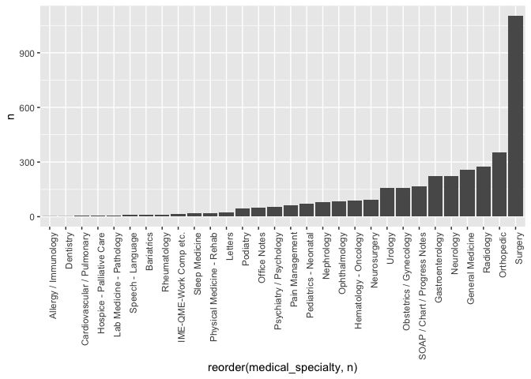
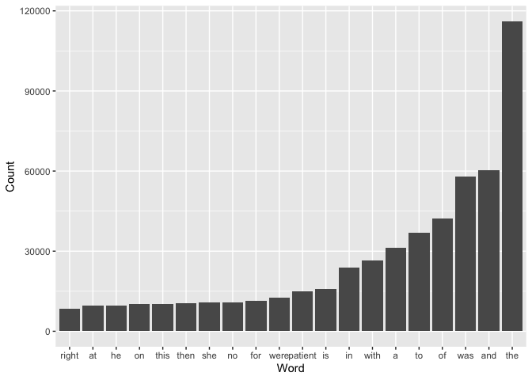
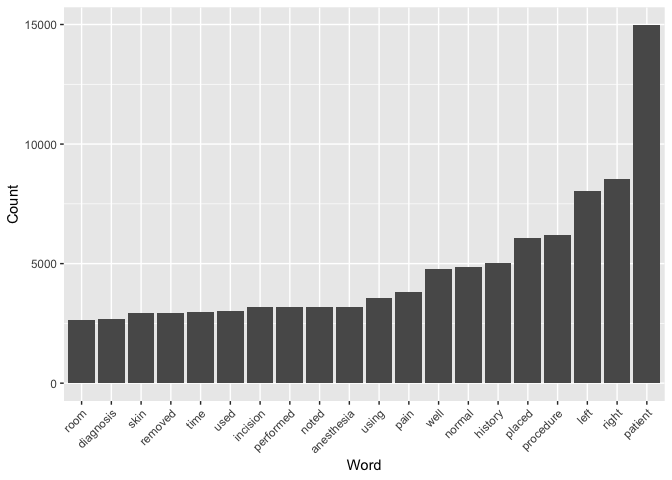
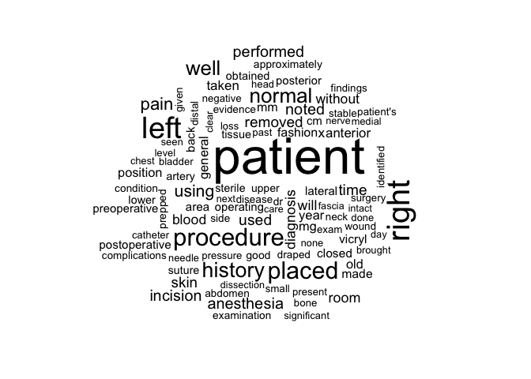
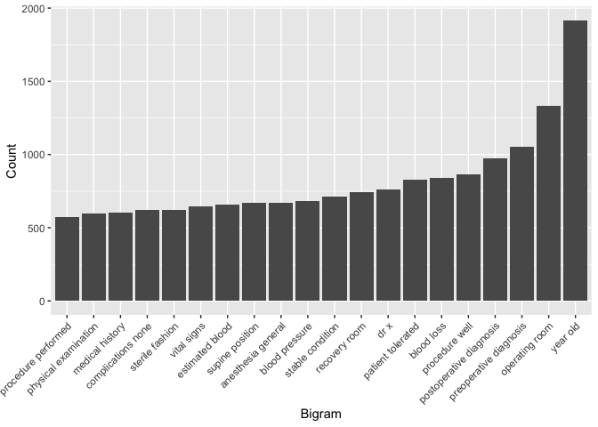
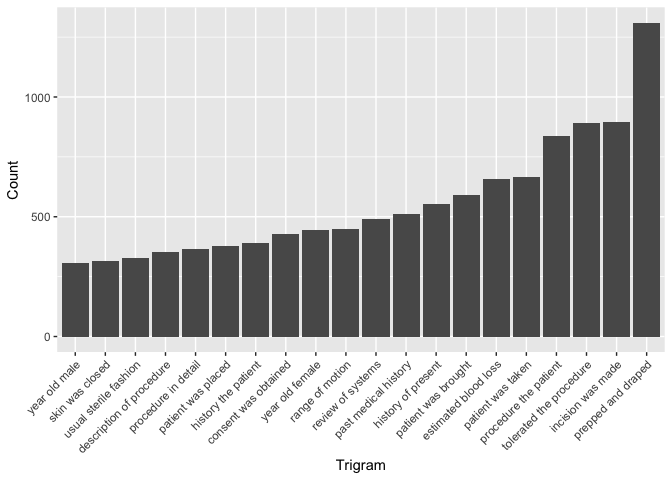
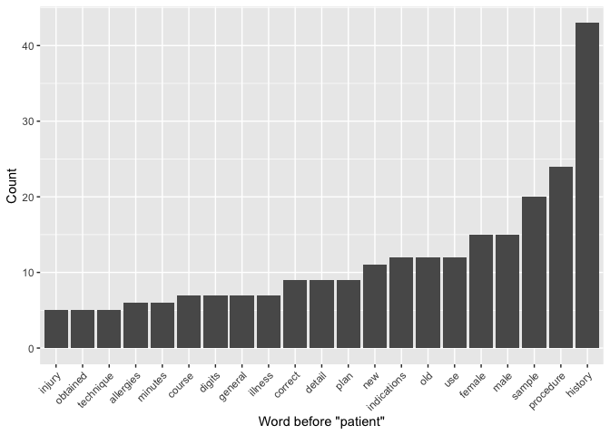
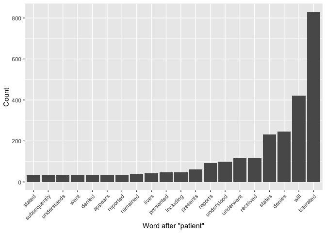
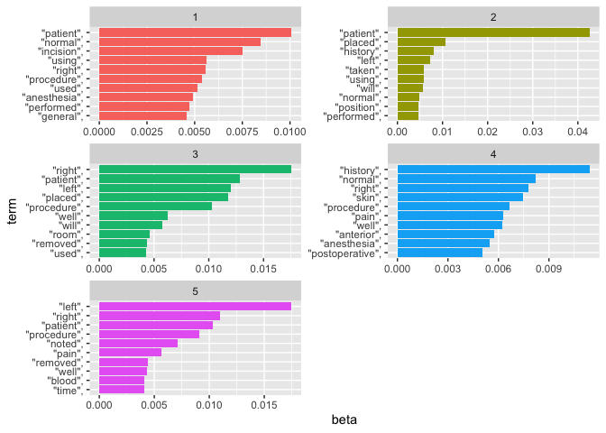
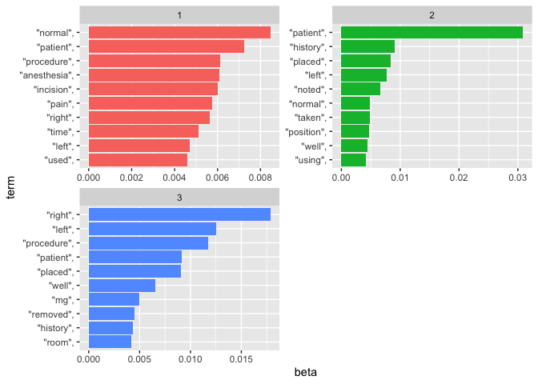

Lab 08 - Text Mining/NLP
================
Elaine Dai
2024-2-28

# Learning goals

- Use `unnest_tokens()` and `unnest_ngrams()` to extract tokens and
  ngrams from text
- Use dplyr and ggplot2 to analyze and visualize text data
- Try a theme model using `topicmodels`

# Lab description

For this lab we will be working with the medical record transcriptions
from <https://www.mtsamples.com/>. And is loaded and “fairly” cleaned at
<https://github.com/JSC370/JSC370-2024/tree/main/data/medical_transcriptions>.

This markdown document should be rendered using `github_document`
document.

### Setup packages

You should load in `dplyr`, (or `data.table` if you want to work that
way), `ggplot2` and `tidytext`. Install `wordcloud`, `tm`, and
`topicmodels` if you don’t alreadyh have them.

``` r
# install.packages("tidytext")
# install.packages("wordcloud")
# install.packages("tm")
# install.packages("topicmodels")
# install.packages("webshot2")
library(dplyr)
library(ggplot2)
library(kableExtra)
library(webshot2)
```

### Read in the Medical Transcriptions

Loading in reference transcription samples from
<https://www.mtsamples.com/>

``` r
library(tidytext)
library(tidyverse)
library(wordcloud)
library(tm)
library(topicmodels)

mt_samples <- read_csv("https://raw.githubusercontent.com/JSC370/JSC370-2024/main/data/medical_transcriptions/mtsamples.csv")
mt_samples <- mt_samples %>%
  select(description, medical_specialty, transcription)

head(mt_samples)
```

    ## # A tibble: 6 × 3
    ##   description                                    medical_specialty transcription
    ##   <chr>                                          <chr>             <chr>        
    ## 1 A 23-year-old white female presents with comp… Allergy / Immuno… "SUBJECTIVE:…
    ## 2 Consult for laparoscopic gastric bypass.       Bariatrics        "PAST MEDICA…
    ## 3 Consult for laparoscopic gastric bypass.       Bariatrics        "HISTORY OF …
    ## 4 2-D M-Mode. Doppler.                           Cardiovascular /… "2-D M-MODE:…
    ## 5 2-D Echocardiogram                             Cardiovascular /… "1.  The lef…
    ## 6 Morbid obesity.  Laparoscopic antecolic anteg… Bariatrics        "PREOPERATIV…

------------------------------------------------------------------------

## Question 1: What specialties do we have?

We can use `count()` from `dplyr` to figure out how many different
medical specialties are in the data. Are these categories related?
overlapping? evenly distributed? Make a bar plot.

``` r
mt_samples |>
  count(medical_specialty, sort = TRUE) |>
  ggplot(aes(reorder(medical_specialty, n), n)) +
  geom_bar(stat = "identity") +
  theme(axis.text.x = element_text(angle = 90, hjust = 1))
```

<!-- -->

``` r
mt_samples |> count(medical_specialty, sort = TRUE)
```

    ## # A tibble: 30 × 2
    ##    medical_specialty                 n
    ##    <chr>                         <int>
    ##  1 Surgery                        1103
    ##  2 Orthopedic                      355
    ##  3 Radiology                       273
    ##  4 General Medicine                259
    ##  5 Gastroenterology                223
    ##  6 Neurology                       223
    ##  7 SOAP / Chart / Progress Notes   166
    ##  8 Obstetrics / Gynecology         160
    ##  9 Urology                         158
    ## 10 Neurosurgery                     94
    ## # ℹ 20 more rows

There are 30 categories, not evenly distributed.

------------------------------------------------------------------------

## Question 2: Tokenize

- Tokenize the the words in the `transcription` column
- Count the number of times each token appears
- Visualize the top 20 most frequent words with a bar plot
- Create a word cloud

Explain what we see from this result. Does it makes sense? What insights
(if any) do we get?

``` r
tokens <- mt_samples |>
  select(transcription) |>
  unnest_tokens(word, transcription) |>
  count(word, sort = TRUE)

tokens |>
  slice_max(order_by = n, n = 20) |>
  ggplot(aes(reorder(word, n), y = n)) +
  labs(y = "Count", x = "Word") +
  geom_bar(stat = "identity")
```

<!-- -->

``` r
wordcloud(tokens$word, tokens$n, max.words = 100)
```

<!-- -->

The words with top occurrence are mostly common stop words, which makes
sense. We need to remove the stop words in order to get insight from the
data.

------------------------------------------------------------------------

## Question 3: Stopwords

- Redo Question 2 but remove stopwords(use stopwords package)
- Bonus points if you remove numbers as well (use regex)

What do we see know that we have removed stop words? Does it give us a
better idea of what the text is about?

- Try customizing your stopwords list to include 3-4 additional words
  that do not appear informative

``` r
head(stopwords("english"))
```

    ## [1] "i"      "me"     "my"     "myself" "we"     "our"

``` r
length(stopwords("english"))
```

    ## [1] 174

``` r
stopwords2 <- c(stopwords("english"), "also", "one", "two")
tokens <- mt_samples |>
  select(transcription) |>
  unnest_tokens(word, transcription) |>
  filter(!word %in% stopwords2) |>
  filter(!grepl("[[:digit:]]+", word)) |>
  count(word, sort = TRUE)

tokens |>
  slice_max(order_by = n, n = 20) |>
  ggplot(aes(reorder(word, n), y = n)) +
  labs(y = "Count", x = "Word") +
  geom_bar(stat = "identity") +
  theme(axis.text.x = element_text(angle = 45, hjust = 1))
```

<!-- -->

``` r
wordcloud(tokens$word, tokens$n, max.words = 100)
```

<!-- -->

We see that the most frequent words after removing stop words are more
medical-related and provides more insight to the context.

------------------------------------------------------------------------

# Question 4: ngrams

Repeat question 2, but this time tokenize into bi-grams. How does the
result change if you look at tri-grams? Note we need to remove stopwords
a little differently. You don’t need to recreate the wordclouds.

``` r
sw_start <- paste0("^", paste(stopwords2, collapse=" |^"), "$")
sw_end <- paste0("", paste(stopwords2, collapse="$| "), "$")
```

``` r
# bigrams
tokens_bigram <- mt_samples |>
  select(transcription) |>
  unnest_tokens(ngram, transcription, token = "ngrams", n = 2) |>
  filter(!grepl(sw_start, ngram, ignore.case = TRUE))|>
  filter(!grepl(sw_end, ngram, ignore.case = TRUE))|>
  filter(!grepl("[[:digit:]]+", ngram))|>
  count(ngram, sort = TRUE)
```

``` r
# trigrams
tokens_trigram <- mt_samples |>
  select(transcription) |>
  unnest_tokens(ngram, transcription, token = "ngrams", n = 3) |>
  filter(!grepl(sw_start, ngram, ignore.case = TRUE))|>
  filter(!grepl(sw_end, ngram, ignore.case = TRUE))|>
  filter(!grepl("^[[:digit:]]+|[[:digit:]]$", ngram))|>
  count(ngram, sort = TRUE)
```

``` r
# plot the bigrams
tokens_bigram |>
  slice_max(order_by = n, n = 20) |>
  ggplot(aes(reorder(ngram, n), y = n)) +
  labs(y = "Count", x = "Bigram") +
  geom_bar(stat = "identity") +
  theme(axis.text.x = element_text(angle = 45, hjust = 1))
```

<!-- -->

``` r
# plot the trigrams
tokens_trigram |>
  slice_max(order_by = n, n = 20) |>
  ggplot(aes(reorder(ngram, n), y = n)) +
  labs(y = "Count", x = "Trigram") +
  geom_bar(stat = "identity") +
  theme(axis.text.x = element_text(angle = 45, hjust = 1))
```

<!-- -->

Trigram phrases provide richer context compared to bigrams.

------------------------------------------------------------------------

# Question 5: Examining words

Using the results from the bigram, pick a word and count the words that
appear before and after it, and create a plot of the top 20.

``` r
library(stringr)
```

``` r
# Words before "patient"
before <- tokens_bigram |>
  filter(str_detect(ngram, regex("\\spatient$"))) |>
  mutate(word = str_remove(ngram, "patient"),
         word = str_remove_all(word, " ")) |>
  group_by(word) |>
  summarise(n = sum(n)) |>
  arrange(desc(n))
before
```

    ## # A tibble: 208 × 2
    ##    word            n
    ##    <chr>       <int>
    ##  1 history        43
    ##  2 procedure      24
    ##  3 sample         20
    ##  4 female         15
    ##  5 male           15
    ##  6 indications    12
    ##  7 old            12
    ##  8 use            12
    ##  9 new            11
    ## 10 correct         9
    ## # ℹ 198 more rows

``` r
before |>
  slice_max(order_by = n, n = 20) |>
  ggplot(aes(reorder(word, n), y = n)) +
  labs(y = "Count", x = 'Word before "patient"') +
  geom_bar(stat = "identity") +
  theme(axis.text.x = element_text(angle = 45, hjust = 1))
```

<!-- -->

``` r
# Words after "patient"
after <- tokens_bigram |>
  filter(str_detect(ngram, regex("^patient\\s"))) |>
  mutate(word = str_remove(ngram, "patient"),
         word = str_remove_all(word, " ")) |>
  group_by(word) |>
  summarise(n = sum(n)) |>
  arrange(desc(n))
after
```

    ## # A tibble: 475 × 2
    ##    word           n
    ##    <chr>      <int>
    ##  1 tolerated    829
    ##  2 will         420
    ##  3 denies       246
    ##  4 states       231
    ##  5 received     118
    ##  6 underwent    116
    ##  7 understood    98
    ##  8 reports       93
    ##  9 presents      61
    ## 10 including     48
    ## # ℹ 465 more rows

``` r
after |>
  slice_max(order_by = n, n = 20) |>
  ggplot(aes(reorder(word, n), y = n)) +
  labs(y = "Count", x = 'Word after "patient"') +
  geom_bar(stat = "identity") +
  theme(axis.text.x = element_text(angle = 45, hjust = 1))
```

<!-- -->

------------------------------------------------------------------------

# Question 6: Words by Specialties

Which words are most used in each of the specialties. you can use
`group_by()` and `top_n()` from `dplyr` to have the calculations be done
within each specialty. Remember to remove stopwords. How about the most
5 used words?

``` r
spe_top1 <- mt_samples |>
  unnest_tokens(word, transcription) |>
  filter(!word %in% stopwords2) |>
  filter(!grepl("[[:digit:]]+", word)) |>
  group_by(medical_specialty) |>
  count(word, sort = TRUE) |>
  slice_max(order_by = n, n = 1)

kable(spe_top1, "html", position = "right") |>
  kable_styling("striped", full_width = FALSE) |>
  scroll_box(width = "100%", height = "500px")
```

<div style="border: 1px solid #ddd; padding: 0px; overflow-y: scroll; height:500px; overflow-x: scroll; width:100%; ">

<table class="table table-striped" style="width: auto !important; margin-left: auto; margin-right: auto;">
<thead>
<tr>
<th style="text-align:left;position: sticky; top:0; background-color: #FFFFFF;">
medical_specialty
</th>
<th style="text-align:left;position: sticky; top:0; background-color: #FFFFFF;">
word
</th>
<th style="text-align:right;position: sticky; top:0; background-color: #FFFFFF;">
n
</th>
</tr>
</thead>
<tbody>
<tr>
<td style="text-align:left;">
Allergy / Immunology
</td>
<td style="text-align:left;">
allergies
</td>
<td style="text-align:right;">
4
</td>
</tr>
<tr>
<td style="text-align:left;">
Allergy / Immunology
</td>
<td style="text-align:left;">
used
</td>
<td style="text-align:right;">
4
</td>
</tr>
<tr>
<td style="text-align:left;">
Bariatrics
</td>
<td style="text-align:left;">
patient
</td>
<td style="text-align:right;">
29
</td>
</tr>
<tr>
<td style="text-align:left;">
Cardiovascular / Pulmonary
</td>
<td style="text-align:left;">
normal
</td>
<td style="text-align:right;">
25
</td>
</tr>
<tr>
<td style="text-align:left;">
Dentistry
</td>
<td style="text-align:left;">
removed
</td>
<td style="text-align:right;">
10
</td>
</tr>
<tr>
<td style="text-align:left;">
Gastroenterology
</td>
<td style="text-align:left;">
patient
</td>
<td style="text-align:right;">
835
</td>
</tr>
<tr>
<td style="text-align:left;">
General Medicine
</td>
<td style="text-align:left;">
patient
</td>
<td style="text-align:right;">
1356
</td>
</tr>
<tr>
<td style="text-align:left;">
Hematology - Oncology
</td>
<td style="text-align:left;">
patient
</td>
<td style="text-align:right;">
316
</td>
</tr>
<tr>
<td style="text-align:left;">
Hospice - Palliative Care
</td>
<td style="text-align:left;">
patient
</td>
<td style="text-align:right;">
43
</td>
</tr>
<tr>
<td style="text-align:left;">
IME-QME-Work Comp etc.
</td>
<td style="text-align:left;">
pain
</td>
<td style="text-align:right;">
152
</td>
</tr>
<tr>
<td style="text-align:left;">
Lab Medicine - Pathology
</td>
<td style="text-align:left;">
cm
</td>
<td style="text-align:right;">
35
</td>
</tr>
<tr>
<td style="text-align:left;">
Lab Medicine - Pathology
</td>
<td style="text-align:left;">
tumor
</td>
<td style="text-align:right;">
35
</td>
</tr>
<tr>
<td style="text-align:left;">
Letters
</td>
<td style="text-align:left;">
pain
</td>
<td style="text-align:right;">
80
</td>
</tr>
<tr>
<td style="text-align:left;">
Nephrology
</td>
<td style="text-align:left;">
patient
</td>
<td style="text-align:right;">
348
</td>
</tr>
<tr>
<td style="text-align:left;">
Neurology
</td>
<td style="text-align:left;">
right
</td>
<td style="text-align:right;">
694
</td>
</tr>
<tr>
<td style="text-align:left;">
Neurosurgery
</td>
<td style="text-align:left;">
patient
</td>
<td style="text-align:right;">
374
</td>
</tr>
<tr>
<td style="text-align:left;">
Obstetrics / Gynecology
</td>
<td style="text-align:left;">
patient
</td>
<td style="text-align:right;">
628
</td>
</tr>
<tr>
<td style="text-align:left;">
Office Notes
</td>
<td style="text-align:left;">
normal
</td>
<td style="text-align:right;">
230
</td>
</tr>
<tr>
<td style="text-align:left;">
Ophthalmology
</td>
<td style="text-align:left;">
eye
</td>
<td style="text-align:right;">
456
</td>
</tr>
<tr>
<td style="text-align:left;">
Orthopedic
</td>
<td style="text-align:left;">
patient
</td>
<td style="text-align:right;">
1711
</td>
</tr>
<tr>
<td style="text-align:left;">
Pain Management
</td>
<td style="text-align:left;">
patient
</td>
<td style="text-align:right;">
236
</td>
</tr>
<tr>
<td style="text-align:left;">
Pediatrics - Neonatal
</td>
<td style="text-align:left;">
patient
</td>
<td style="text-align:right;">
247
</td>
</tr>
<tr>
<td style="text-align:left;">
Physical Medicine - Rehab
</td>
<td style="text-align:left;">
patient
</td>
<td style="text-align:right;">
220
</td>
</tr>
<tr>
<td style="text-align:left;">
Podiatry
</td>
<td style="text-align:left;">
foot
</td>
<td style="text-align:right;">
232
</td>
</tr>
<tr>
<td style="text-align:left;">
Psychiatry / Psychology
</td>
<td style="text-align:left;">
patient
</td>
<td style="text-align:right;">
532
</td>
</tr>
<tr>
<td style="text-align:left;">
Radiology
</td>
<td style="text-align:left;">
left
</td>
<td style="text-align:right;">
701
</td>
</tr>
<tr>
<td style="text-align:left;">
Rheumatology
</td>
<td style="text-align:left;">
history
</td>
<td style="text-align:right;">
50
</td>
</tr>
<tr>
<td style="text-align:left;">
SOAP / Chart / Progress Notes
</td>
<td style="text-align:left;">
patient
</td>
<td style="text-align:right;">
537
</td>
</tr>
<tr>
<td style="text-align:left;">
Sleep Medicine
</td>
<td style="text-align:left;">
sleep
</td>
<td style="text-align:right;">
143
</td>
</tr>
<tr>
<td style="text-align:left;">
Speech - Language
</td>
<td style="text-align:left;">
patient
</td>
<td style="text-align:right;">
105
</td>
</tr>
<tr>
<td style="text-align:left;">
Surgery
</td>
<td style="text-align:left;">
patient
</td>
<td style="text-align:right;">
4855
</td>
</tr>
<tr>
<td style="text-align:left;">
Urology
</td>
<td style="text-align:left;">
patient
</td>
<td style="text-align:right;">
776
</td>
</tr>
</tbody>
</table>

</div>

``` r
spe_top5 <- mt_samples |>
  unnest_tokens(word, transcription) |>
  filter(!word %in% stopwords2) |>
  filter(!grepl("[[:digit:]]+", word)) |>
  group_by(medical_specialty) |>
  count(word, sort = TRUE) |>
  slice_max(order_by = n, n = 5)

kable(spe_top5, "html", position = "right") |>
  kable_styling("striped", full_width = FALSE) |>
  scroll_box(width = "100%", height = "500px")
```

<div style="border: 1px solid #ddd; padding: 0px; overflow-y: scroll; height:500px; overflow-x: scroll; width:100%; ">

<table class="table table-striped" style="width: auto !important; margin-left: auto; margin-right: auto;">
<thead>
<tr>
<th style="text-align:left;position: sticky; top:0; background-color: #FFFFFF;">
medical_specialty
</th>
<th style="text-align:left;position: sticky; top:0; background-color: #FFFFFF;">
word
</th>
<th style="text-align:right;position: sticky; top:0; background-color: #FFFFFF;">
n
</th>
</tr>
</thead>
<tbody>
<tr>
<td style="text-align:left;">
Allergy / Immunology
</td>
<td style="text-align:left;">
allergies
</td>
<td style="text-align:right;">
4
</td>
</tr>
<tr>
<td style="text-align:left;">
Allergy / Immunology
</td>
<td style="text-align:left;">
used
</td>
<td style="text-align:right;">
4
</td>
</tr>
<tr>
<td style="text-align:left;">
Allergy / Immunology
</td>
<td style="text-align:left;">
allegra
</td>
<td style="text-align:right;">
3
</td>
</tr>
<tr>
<td style="text-align:left;">
Allergy / Immunology
</td>
<td style="text-align:left;">
clear
</td>
<td style="text-align:right;">
3
</td>
</tr>
<tr>
<td style="text-align:left;">
Allergy / Immunology
</td>
<td style="text-align:left;">
prescription
</td>
<td style="text-align:right;">
3
</td>
</tr>
<tr>
<td style="text-align:left;">
Allergy / Immunology
</td>
<td style="text-align:left;">
sprays
</td>
<td style="text-align:right;">
3
</td>
</tr>
<tr>
<td style="text-align:left;">
Bariatrics
</td>
<td style="text-align:left;">
patient
</td>
<td style="text-align:right;">
29
</td>
</tr>
<tr>
<td style="text-align:left;">
Bariatrics
</td>
<td style="text-align:left;">
history
</td>
<td style="text-align:right;">
21
</td>
</tr>
<tr>
<td style="text-align:left;">
Bariatrics
</td>
<td style="text-align:left;">
placed
</td>
<td style="text-align:right;">
21
</td>
</tr>
<tr>
<td style="text-align:left;">
Bariatrics
</td>
<td style="text-align:left;">
abdomen
</td>
<td style="text-align:right;">
20
</td>
</tr>
<tr>
<td style="text-align:left;">
Bariatrics
</td>
<td style="text-align:left;">
procedure
</td>
<td style="text-align:right;">
18
</td>
</tr>
<tr>
<td style="text-align:left;">
Cardiovascular / Pulmonary
</td>
<td style="text-align:left;">
normal
</td>
<td style="text-align:right;">
25
</td>
</tr>
<tr>
<td style="text-align:left;">
Cardiovascular / Pulmonary
</td>
<td style="text-align:left;">
left
</td>
<td style="text-align:right;">
18
</td>
</tr>
<tr>
<td style="text-align:left;">
Cardiovascular / Pulmonary
</td>
<td style="text-align:left;">
trachea
</td>
<td style="text-align:right;">
17
</td>
</tr>
<tr>
<td style="text-align:left;">
Cardiovascular / Pulmonary
</td>
<td style="text-align:left;">
valve
</td>
<td style="text-align:right;">
15
</td>
</tr>
<tr>
<td style="text-align:left;">
Cardiovascular / Pulmonary
</td>
<td style="text-align:left;">
aortic
</td>
<td style="text-align:right;">
12
</td>
</tr>
<tr>
<td style="text-align:left;">
Dentistry
</td>
<td style="text-align:left;">
removed
</td>
<td style="text-align:right;">
10
</td>
</tr>
<tr>
<td style="text-align:left;">
Dentistry
</td>
<td style="text-align:left;">
elevator
</td>
<td style="text-align:right;">
8
</td>
</tr>
<tr>
<td style="text-align:left;">
Dentistry
</td>
<td style="text-align:left;">
tooth
</td>
<td style="text-align:right;">
7
</td>
</tr>
<tr>
<td style="text-align:left;">
Dentistry
</td>
<td style="text-align:left;">
area
</td>
<td style="text-align:right;">
4
</td>
</tr>
<tr>
<td style="text-align:left;">
Dentistry
</td>
<td style="text-align:left;">
aspect
</td>
<td style="text-align:right;">
4
</td>
</tr>
<tr>
<td style="text-align:left;">
Dentistry
</td>
<td style="text-align:left;">
blade
</td>
<td style="text-align:right;">
4
</td>
</tr>
<tr>
<td style="text-align:left;">
Dentistry
</td>
<td style="text-align:left;">
bone
</td>
<td style="text-align:right;">
4
</td>
</tr>
<tr>
<td style="text-align:left;">
Dentistry
</td>
<td style="text-align:left;">
buccal
</td>
<td style="text-align:right;">
4
</td>
</tr>
<tr>
<td style="text-align:left;">
Dentistry
</td>
<td style="text-align:left;">
bur
</td>
<td style="text-align:right;">
4
</td>
</tr>
<tr>
<td style="text-align:left;">
Dentistry
</td>
<td style="text-align:left;">
closed
</td>
<td style="text-align:right;">
4
</td>
</tr>
<tr>
<td style="text-align:left;">
Dentistry
</td>
<td style="text-align:left;">
envelope
</td>
<td style="text-align:right;">
4
</td>
</tr>
<tr>
<td style="text-align:left;">
Dentistry
</td>
<td style="text-align:left;">
flap
</td>
<td style="text-align:right;">
4
</td>
</tr>
<tr>
<td style="text-align:left;">
Dentistry
</td>
<td style="text-align:left;">
follicle
</td>
<td style="text-align:right;">
4
</td>
</tr>
<tr>
<td style="text-align:left;">
Dentistry
</td>
<td style="text-align:left;">
gut
</td>
<td style="text-align:right;">
4
</td>
</tr>
<tr>
<td style="text-align:left;">
Dentistry
</td>
<td style="text-align:left;">
incision
</td>
<td style="text-align:right;">
4
</td>
</tr>
<tr>
<td style="text-align:left;">
Dentistry
</td>
<td style="text-align:left;">
irrigated
</td>
<td style="text-align:right;">
4
</td>
</tr>
<tr>
<td style="text-align:left;">
Dentistry
</td>
<td style="text-align:left;">
made
</td>
<td style="text-align:right;">
4
</td>
</tr>
<tr>
<td style="text-align:left;">
Dentistry
</td>
<td style="text-align:left;">
periosteal
</td>
<td style="text-align:right;">
4
</td>
</tr>
<tr>
<td style="text-align:left;">
Dentistry
</td>
<td style="text-align:left;">
procedure
</td>
<td style="text-align:right;">
4
</td>
</tr>
<tr>
<td style="text-align:left;">
Dentistry
</td>
<td style="text-align:left;">
raised
</td>
<td style="text-align:right;">
4
</td>
</tr>
<tr>
<td style="text-align:left;">
Dentistry
</td>
<td style="text-align:left;">
remnants
</td>
<td style="text-align:right;">
4
</td>
</tr>
<tr>
<td style="text-align:left;">
Gastroenterology
</td>
<td style="text-align:left;">
patient
</td>
<td style="text-align:right;">
835
</td>
</tr>
<tr>
<td style="text-align:left;">
Gastroenterology
</td>
<td style="text-align:left;">
procedure
</td>
<td style="text-align:right;">
455
</td>
</tr>
<tr>
<td style="text-align:left;">
Gastroenterology
</td>
<td style="text-align:left;">
history
</td>
<td style="text-align:right;">
324
</td>
</tr>
<tr>
<td style="text-align:left;">
Gastroenterology
</td>
<td style="text-align:left;">
normal
</td>
<td style="text-align:right;">
318
</td>
</tr>
<tr>
<td style="text-align:left;">
Gastroenterology
</td>
<td style="text-align:left;">
placed
</td>
<td style="text-align:right;">
287
</td>
</tr>
<tr>
<td style="text-align:left;">
General Medicine
</td>
<td style="text-align:left;">
patient
</td>
<td style="text-align:right;">
1356
</td>
</tr>
<tr>
<td style="text-align:left;">
General Medicine
</td>
<td style="text-align:left;">
history
</td>
<td style="text-align:right;">
1027
</td>
</tr>
<tr>
<td style="text-align:left;">
General Medicine
</td>
<td style="text-align:left;">
normal
</td>
<td style="text-align:right;">
717
</td>
</tr>
<tr>
<td style="text-align:left;">
General Medicine
</td>
<td style="text-align:left;">
pain
</td>
<td style="text-align:right;">
567
</td>
</tr>
<tr>
<td style="text-align:left;">
General Medicine
</td>
<td style="text-align:left;">
mg
</td>
<td style="text-align:right;">
503
</td>
</tr>
<tr>
<td style="text-align:left;">
Hematology - Oncology
</td>
<td style="text-align:left;">
patient
</td>
<td style="text-align:right;">
316
</td>
</tr>
<tr>
<td style="text-align:left;">
Hematology - Oncology
</td>
<td style="text-align:left;">
history
</td>
<td style="text-align:right;">
290
</td>
</tr>
<tr>
<td style="text-align:left;">
Hematology - Oncology
</td>
<td style="text-align:left;">
right
</td>
<td style="text-align:right;">
196
</td>
</tr>
<tr>
<td style="text-align:left;">
Hematology - Oncology
</td>
<td style="text-align:left;">
left
</td>
<td style="text-align:right;">
187
</td>
</tr>
<tr>
<td style="text-align:left;">
Hematology - Oncology
</td>
<td style="text-align:left;">
well
</td>
<td style="text-align:right;">
120
</td>
</tr>
<tr>
<td style="text-align:left;">
Hospice - Palliative Care
</td>
<td style="text-align:left;">
patient
</td>
<td style="text-align:right;">
43
</td>
</tr>
<tr>
<td style="text-align:left;">
Hospice - Palliative Care
</td>
<td style="text-align:left;">
mg
</td>
<td style="text-align:right;">
28
</td>
</tr>
<tr>
<td style="text-align:left;">
Hospice - Palliative Care
</td>
<td style="text-align:left;">
history
</td>
<td style="text-align:right;">
27
</td>
</tr>
<tr>
<td style="text-align:left;">
Hospice - Palliative Care
</td>
<td style="text-align:left;">
daughter
</td>
<td style="text-align:right;">
22
</td>
</tr>
<tr>
<td style="text-align:left;">
Hospice - Palliative Care
</td>
<td style="text-align:left;">
family
</td>
<td style="text-align:right;">
19
</td>
</tr>
<tr>
<td style="text-align:left;">
Hospice - Palliative Care
</td>
<td style="text-align:left;">
pain
</td>
<td style="text-align:right;">
19
</td>
</tr>
<tr>
<td style="text-align:left;">
IME-QME-Work Comp etc.
</td>
<td style="text-align:left;">
pain
</td>
<td style="text-align:right;">
152
</td>
</tr>
<tr>
<td style="text-align:left;">
IME-QME-Work Comp etc.
</td>
<td style="text-align:left;">
right
</td>
<td style="text-align:right;">
131
</td>
</tr>
<tr>
<td style="text-align:left;">
IME-QME-Work Comp etc.
</td>
<td style="text-align:left;">
patient
</td>
<td style="text-align:right;">
106
</td>
</tr>
<tr>
<td style="text-align:left;">
IME-QME-Work Comp etc.
</td>
<td style="text-align:left;">
back
</td>
<td style="text-align:right;">
105
</td>
</tr>
<tr>
<td style="text-align:left;">
IME-QME-Work Comp etc.
</td>
<td style="text-align:left;">
dr
</td>
<td style="text-align:right;">
82
</td>
</tr>
<tr>
<td style="text-align:left;">
Lab Medicine - Pathology
</td>
<td style="text-align:left;">
cm
</td>
<td style="text-align:right;">
35
</td>
</tr>
<tr>
<td style="text-align:left;">
Lab Medicine - Pathology
</td>
<td style="text-align:left;">
tumor
</td>
<td style="text-align:right;">
35
</td>
</tr>
<tr>
<td style="text-align:left;">
Lab Medicine - Pathology
</td>
<td style="text-align:left;">
x
</td>
<td style="text-align:right;">
32
</td>
</tr>
<tr>
<td style="text-align:left;">
Lab Medicine - Pathology
</td>
<td style="text-align:left;">
right
</td>
<td style="text-align:right;">
31
</td>
</tr>
<tr>
<td style="text-align:left;">
Lab Medicine - Pathology
</td>
<td style="text-align:left;">
lymph
</td>
<td style="text-align:right;">
30
</td>
</tr>
<tr>
<td style="text-align:left;">
Letters
</td>
<td style="text-align:left;">
pain
</td>
<td style="text-align:right;">
80
</td>
</tr>
<tr>
<td style="text-align:left;">
Letters
</td>
<td style="text-align:left;">
abc
</td>
<td style="text-align:right;">
71
</td>
</tr>
<tr>
<td style="text-align:left;">
Letters
</td>
<td style="text-align:left;">
patient
</td>
<td style="text-align:right;">
65
</td>
</tr>
<tr>
<td style="text-align:left;">
Letters
</td>
<td style="text-align:left;">
normal
</td>
<td style="text-align:right;">
53
</td>
</tr>
<tr>
<td style="text-align:left;">
Letters
</td>
<td style="text-align:left;">
mr
</td>
<td style="text-align:right;">
52
</td>
</tr>
<tr>
<td style="text-align:left;">
Nephrology
</td>
<td style="text-align:left;">
patient
</td>
<td style="text-align:right;">
348
</td>
</tr>
<tr>
<td style="text-align:left;">
Nephrology
</td>
<td style="text-align:left;">
renal
</td>
<td style="text-align:right;">
257
</td>
</tr>
<tr>
<td style="text-align:left;">
Nephrology
</td>
<td style="text-align:left;">
right
</td>
<td style="text-align:right;">
243
</td>
</tr>
<tr>
<td style="text-align:left;">
Nephrology
</td>
<td style="text-align:left;">
history
</td>
<td style="text-align:right;">
160
</td>
</tr>
<tr>
<td style="text-align:left;">
Nephrology
</td>
<td style="text-align:left;">
kidney
</td>
<td style="text-align:right;">
144
</td>
</tr>
<tr>
<td style="text-align:left;">
Neurology
</td>
<td style="text-align:left;">
right
</td>
<td style="text-align:right;">
694
</td>
</tr>
<tr>
<td style="text-align:left;">
Neurology
</td>
<td style="text-align:left;">
left
</td>
<td style="text-align:right;">
672
</td>
</tr>
<tr>
<td style="text-align:left;">
Neurology
</td>
<td style="text-align:left;">
patient
</td>
<td style="text-align:right;">
648
</td>
</tr>
<tr>
<td style="text-align:left;">
Neurology
</td>
<td style="text-align:left;">
normal
</td>
<td style="text-align:right;">
485
</td>
</tr>
<tr>
<td style="text-align:left;">
Neurology
</td>
<td style="text-align:left;">
history
</td>
<td style="text-align:right;">
429
</td>
</tr>
<tr>
<td style="text-align:left;">
Neurosurgery
</td>
<td style="text-align:left;">
patient
</td>
<td style="text-align:right;">
374
</td>
</tr>
<tr>
<td style="text-align:left;">
Neurosurgery
</td>
<td style="text-align:left;">
placed
</td>
<td style="text-align:right;">
282
</td>
</tr>
<tr>
<td style="text-align:left;">
Neurosurgery
</td>
<td style="text-align:left;">
right
</td>
<td style="text-align:right;">
260
</td>
</tr>
<tr>
<td style="text-align:left;">
Neurosurgery
</td>
<td style="text-align:left;">
procedure
</td>
<td style="text-align:right;">
247
</td>
</tr>
<tr>
<td style="text-align:left;">
Neurosurgery
</td>
<td style="text-align:left;">
left
</td>
<td style="text-align:right;">
222
</td>
</tr>
<tr>
<td style="text-align:left;">
Obstetrics / Gynecology
</td>
<td style="text-align:left;">
patient
</td>
<td style="text-align:right;">
628
</td>
</tr>
<tr>
<td style="text-align:left;">
Obstetrics / Gynecology
</td>
<td style="text-align:left;">
placed
</td>
<td style="text-align:right;">
350
</td>
</tr>
<tr>
<td style="text-align:left;">
Obstetrics / Gynecology
</td>
<td style="text-align:left;">
uterus
</td>
<td style="text-align:right;">
317
</td>
</tr>
<tr>
<td style="text-align:left;">
Obstetrics / Gynecology
</td>
<td style="text-align:left;">
procedure
</td>
<td style="text-align:right;">
301
</td>
</tr>
<tr>
<td style="text-align:left;">
Obstetrics / Gynecology
</td>
<td style="text-align:left;">
incision
</td>
<td style="text-align:right;">
293
</td>
</tr>
<tr>
<td style="text-align:left;">
Office Notes
</td>
<td style="text-align:left;">
normal
</td>
<td style="text-align:right;">
230
</td>
</tr>
<tr>
<td style="text-align:left;">
Office Notes
</td>
<td style="text-align:left;">
negative
</td>
<td style="text-align:right;">
193
</td>
</tr>
<tr>
<td style="text-align:left;">
Office Notes
</td>
<td style="text-align:left;">
without
</td>
<td style="text-align:right;">
99
</td>
</tr>
<tr>
<td style="text-align:left;">
Office Notes
</td>
<td style="text-align:left;">
patient
</td>
<td style="text-align:right;">
94
</td>
</tr>
<tr>
<td style="text-align:left;">
Office Notes
</td>
<td style="text-align:left;">
history
</td>
<td style="text-align:right;">
76
</td>
</tr>
<tr>
<td style="text-align:left;">
Ophthalmology
</td>
<td style="text-align:left;">
eye
</td>
<td style="text-align:right;">
456
</td>
</tr>
<tr>
<td style="text-align:left;">
Ophthalmology
</td>
<td style="text-align:left;">
patient
</td>
<td style="text-align:right;">
258
</td>
</tr>
<tr>
<td style="text-align:left;">
Ophthalmology
</td>
<td style="text-align:left;">
right
</td>
<td style="text-align:right;">
192
</td>
</tr>
<tr>
<td style="text-align:left;">
Ophthalmology
</td>
<td style="text-align:left;">
procedure
</td>
<td style="text-align:right;">
176
</td>
</tr>
<tr>
<td style="text-align:left;">
Ophthalmology
</td>
<td style="text-align:left;">
placed
</td>
<td style="text-align:right;">
168
</td>
</tr>
<tr>
<td style="text-align:left;">
Orthopedic
</td>
<td style="text-align:left;">
patient
</td>
<td style="text-align:right;">
1711
</td>
</tr>
<tr>
<td style="text-align:left;">
Orthopedic
</td>
<td style="text-align:left;">
right
</td>
<td style="text-align:right;">
1172
</td>
</tr>
<tr>
<td style="text-align:left;">
Orthopedic
</td>
<td style="text-align:left;">
left
</td>
<td style="text-align:right;">
998
</td>
</tr>
<tr>
<td style="text-align:left;">
Orthopedic
</td>
<td style="text-align:left;">
placed
</td>
<td style="text-align:right;">
924
</td>
</tr>
<tr>
<td style="text-align:left;">
Orthopedic
</td>
<td style="text-align:left;">
pain
</td>
<td style="text-align:right;">
763
</td>
</tr>
<tr>
<td style="text-align:left;">
Pain Management
</td>
<td style="text-align:left;">
patient
</td>
<td style="text-align:right;">
236
</td>
</tr>
<tr>
<td style="text-align:left;">
Pain Management
</td>
<td style="text-align:left;">
procedure
</td>
<td style="text-align:right;">
197
</td>
</tr>
<tr>
<td style="text-align:left;">
Pain Management
</td>
<td style="text-align:left;">
needle
</td>
<td style="text-align:right;">
156
</td>
</tr>
<tr>
<td style="text-align:left;">
Pain Management
</td>
<td style="text-align:left;">
placed
</td>
<td style="text-align:right;">
99
</td>
</tr>
<tr>
<td style="text-align:left;">
Pain Management
</td>
<td style="text-align:left;">
injected
</td>
<td style="text-align:right;">
76
</td>
</tr>
<tr>
<td style="text-align:left;">
Pain Management
</td>
<td style="text-align:left;">
pain
</td>
<td style="text-align:right;">
76
</td>
</tr>
<tr>
<td style="text-align:left;">
Pediatrics - Neonatal
</td>
<td style="text-align:left;">
patient
</td>
<td style="text-align:right;">
247
</td>
</tr>
<tr>
<td style="text-align:left;">
Pediatrics - Neonatal
</td>
<td style="text-align:left;">
history
</td>
<td style="text-align:right;">
235
</td>
</tr>
<tr>
<td style="text-align:left;">
Pediatrics - Neonatal
</td>
<td style="text-align:left;">
well
</td>
<td style="text-align:right;">
159
</td>
</tr>
<tr>
<td style="text-align:left;">
Pediatrics - Neonatal
</td>
<td style="text-align:left;">
normal
</td>
<td style="text-align:right;">
155
</td>
</tr>
<tr>
<td style="text-align:left;">
Pediatrics - Neonatal
</td>
<td style="text-align:left;">
old
</td>
<td style="text-align:right;">
93
</td>
</tr>
<tr>
<td style="text-align:left;">
Physical Medicine - Rehab
</td>
<td style="text-align:left;">
patient
</td>
<td style="text-align:right;">
220
</td>
</tr>
<tr>
<td style="text-align:left;">
Physical Medicine - Rehab
</td>
<td style="text-align:left;">
right
</td>
<td style="text-align:right;">
107
</td>
</tr>
<tr>
<td style="text-align:left;">
Physical Medicine - Rehab
</td>
<td style="text-align:left;">
left
</td>
<td style="text-align:right;">
104
</td>
</tr>
<tr>
<td style="text-align:left;">
Physical Medicine - Rehab
</td>
<td style="text-align:left;">
pain
</td>
<td style="text-align:right;">
95
</td>
</tr>
<tr>
<td style="text-align:left;">
Physical Medicine - Rehab
</td>
<td style="text-align:left;">
motor
</td>
<td style="text-align:right;">
62
</td>
</tr>
<tr>
<td style="text-align:left;">
Podiatry
</td>
<td style="text-align:left;">
foot
</td>
<td style="text-align:right;">
232
</td>
</tr>
<tr>
<td style="text-align:left;">
Podiatry
</td>
<td style="text-align:left;">
patient
</td>
<td style="text-align:right;">
231
</td>
</tr>
<tr>
<td style="text-align:left;">
Podiatry
</td>
<td style="text-align:left;">
right
</td>
<td style="text-align:right;">
156
</td>
</tr>
<tr>
<td style="text-align:left;">
Podiatry
</td>
<td style="text-align:left;">
left
</td>
<td style="text-align:right;">
137
</td>
</tr>
<tr>
<td style="text-align:left;">
Podiatry
</td>
<td style="text-align:left;">
tendon
</td>
<td style="text-align:right;">
98
</td>
</tr>
<tr>
<td style="text-align:left;">
Psychiatry / Psychology
</td>
<td style="text-align:left;">
patient
</td>
<td style="text-align:right;">
532
</td>
</tr>
<tr>
<td style="text-align:left;">
Psychiatry / Psychology
</td>
<td style="text-align:left;">
history
</td>
<td style="text-align:right;">
344
</td>
</tr>
<tr>
<td style="text-align:left;">
Psychiatry / Psychology
</td>
<td style="text-align:left;">
mg
</td>
<td style="text-align:right;">
183
</td>
</tr>
<tr>
<td style="text-align:left;">
Psychiatry / Psychology
</td>
<td style="text-align:left;">
mother
</td>
<td style="text-align:right;">
164
</td>
</tr>
<tr>
<td style="text-align:left;">
Psychiatry / Psychology
</td>
<td style="text-align:left;">
reported
</td>
<td style="text-align:right;">
141
</td>
</tr>
<tr>
<td style="text-align:left;">
Radiology
</td>
<td style="text-align:left;">
left
</td>
<td style="text-align:right;">
701
</td>
</tr>
<tr>
<td style="text-align:left;">
Radiology
</td>
<td style="text-align:left;">
normal
</td>
<td style="text-align:right;">
644
</td>
</tr>
<tr>
<td style="text-align:left;">
Radiology
</td>
<td style="text-align:left;">
right
</td>
<td style="text-align:right;">
644
</td>
</tr>
<tr>
<td style="text-align:left;">
Radiology
</td>
<td style="text-align:left;">
patient
</td>
<td style="text-align:right;">
304
</td>
</tr>
<tr>
<td style="text-align:left;">
Radiology
</td>
<td style="text-align:left;">
exam
</td>
<td style="text-align:right;">
302
</td>
</tr>
<tr>
<td style="text-align:left;">
Rheumatology
</td>
<td style="text-align:left;">
history
</td>
<td style="text-align:right;">
50
</td>
</tr>
<tr>
<td style="text-align:left;">
Rheumatology
</td>
<td style="text-align:left;">
patient
</td>
<td style="text-align:right;">
34
</td>
</tr>
<tr>
<td style="text-align:left;">
Rheumatology
</td>
<td style="text-align:left;">
mg
</td>
<td style="text-align:right;">
26
</td>
</tr>
<tr>
<td style="text-align:left;">
Rheumatology
</td>
<td style="text-align:left;">
pain
</td>
<td style="text-align:right;">
23
</td>
</tr>
<tr>
<td style="text-align:left;">
Rheumatology
</td>
<td style="text-align:left;">
day
</td>
<td style="text-align:right;">
22
</td>
</tr>
<tr>
<td style="text-align:left;">
Rheumatology
</td>
<td style="text-align:left;">
examination
</td>
<td style="text-align:right;">
22
</td>
</tr>
<tr>
<td style="text-align:left;">
Rheumatology
</td>
<td style="text-align:left;">
joints
</td>
<td style="text-align:right;">
22
</td>
</tr>
<tr>
<td style="text-align:left;">
SOAP / Chart / Progress Notes
</td>
<td style="text-align:left;">
patient
</td>
<td style="text-align:right;">
537
</td>
</tr>
<tr>
<td style="text-align:left;">
SOAP / Chart / Progress Notes
</td>
<td style="text-align:left;">
mg
</td>
<td style="text-align:right;">
302
</td>
</tr>
<tr>
<td style="text-align:left;">
SOAP / Chart / Progress Notes
</td>
<td style="text-align:left;">
will
</td>
<td style="text-align:right;">
274
</td>
</tr>
<tr>
<td style="text-align:left;">
SOAP / Chart / Progress Notes
</td>
<td style="text-align:left;">
history
</td>
<td style="text-align:right;">
254
</td>
</tr>
<tr>
<td style="text-align:left;">
SOAP / Chart / Progress Notes
</td>
<td style="text-align:left;">
pain
</td>
<td style="text-align:right;">
239
</td>
</tr>
<tr>
<td style="text-align:left;">
Sleep Medicine
</td>
<td style="text-align:left;">
sleep
</td>
<td style="text-align:right;">
143
</td>
</tr>
<tr>
<td style="text-align:left;">
Sleep Medicine
</td>
<td style="text-align:left;">
patient
</td>
<td style="text-align:right;">
69
</td>
</tr>
<tr>
<td style="text-align:left;">
Sleep Medicine
</td>
<td style="text-align:left;">
apnea
</td>
<td style="text-align:right;">
35
</td>
</tr>
<tr>
<td style="text-align:left;">
Sleep Medicine
</td>
<td style="text-align:left;">
activity
</td>
<td style="text-align:right;">
31
</td>
</tr>
<tr>
<td style="text-align:left;">
Sleep Medicine
</td>
<td style="text-align:left;">
stage
</td>
<td style="text-align:right;">
29
</td>
</tr>
<tr>
<td style="text-align:left;">
Speech - Language
</td>
<td style="text-align:left;">
patient
</td>
<td style="text-align:right;">
105
</td>
</tr>
<tr>
<td style="text-align:left;">
Speech - Language
</td>
<td style="text-align:left;">
therapy
</td>
<td style="text-align:right;">
41
</td>
</tr>
<tr>
<td style="text-align:left;">
Speech - Language
</td>
<td style="text-align:left;">
speech
</td>
<td style="text-align:right;">
35
</td>
</tr>
<tr>
<td style="text-align:left;">
Speech - Language
</td>
<td style="text-align:left;">
patient’s
</td>
<td style="text-align:right;">
28
</td>
</tr>
<tr>
<td style="text-align:left;">
Speech - Language
</td>
<td style="text-align:left;">
able
</td>
<td style="text-align:right;">
26
</td>
</tr>
<tr>
<td style="text-align:left;">
Surgery
</td>
<td style="text-align:left;">
patient
</td>
<td style="text-align:right;">
4855
</td>
</tr>
<tr>
<td style="text-align:left;">
Surgery
</td>
<td style="text-align:left;">
left
</td>
<td style="text-align:right;">
3263
</td>
</tr>
<tr>
<td style="text-align:left;">
Surgery
</td>
<td style="text-align:left;">
right
</td>
<td style="text-align:right;">
3261
</td>
</tr>
<tr>
<td style="text-align:left;">
Surgery
</td>
<td style="text-align:left;">
procedure
</td>
<td style="text-align:right;">
3243
</td>
</tr>
<tr>
<td style="text-align:left;">
Surgery
</td>
<td style="text-align:left;">
placed
</td>
<td style="text-align:right;">
3025
</td>
</tr>
<tr>
<td style="text-align:left;">
Urology
</td>
<td style="text-align:left;">
patient
</td>
<td style="text-align:right;">
776
</td>
</tr>
<tr>
<td style="text-align:left;">
Urology
</td>
<td style="text-align:left;">
bladder
</td>
<td style="text-align:right;">
357
</td>
</tr>
<tr>
<td style="text-align:left;">
Urology
</td>
<td style="text-align:left;">
right
</td>
<td style="text-align:right;">
307
</td>
</tr>
<tr>
<td style="text-align:left;">
Urology
</td>
<td style="text-align:left;">
procedure
</td>
<td style="text-align:right;">
306
</td>
</tr>
<tr>
<td style="text-align:left;">
Urology
</td>
<td style="text-align:left;">
placed
</td>
<td style="text-align:right;">
305
</td>
</tr>
</tbody>
</table>

</div>

# Question 7: Topic Models

See if there are any themes in the data by using a topic model (LDA).

- you first need to create a document term matrix
- then you can try the LDA function in `topicmodels`. Try different k
  values.
- create a facet plot of the results from the LDA (see code from
  lecture)

``` r
transcripts_dtm <- mt_samples |>
  select(transcription) |>
  unnest_tokens(word, transcription) |>
  filter(!word %in% stopwords2) |>
  filter(!grepl("[[:digit:]]+", word)) |>
  DocumentTermMatrix()

transcripts_dtm <- as.matrix(transcripts_dtm)
```

``` r
transcripts_lda5 <- LDA(transcripts_dtm, k = 5, control = list(seed = 1234))
transcripts_lda3 <- LDA(transcripts_dtm, k = 3, control = list(seed = 1234))
```

``` r
lda5_top_terms <- 
  tidy(transcripts_lda5, matrix = "beta") |>
  group_by(topic) |>
  slice_max(order_by = beta, n = 10) |>
  ungroup() |>
  arrange(topic, -beta) |>
  mutate(term = reorder_within(term, beta, topic))
lda5_top_terms
```

    ## # A tibble: 50 × 3
    ##    topic term                     beta
    ##    <int> <fct>                   <dbl>
    ##  1     1 "\"patient\",___1"    0.0101 
    ##  2     1 "\"normal\",___1"     0.00846
    ##  3     1 "\"incision\",___1"   0.00753
    ##  4     1 "\"using\",___1"      0.00563
    ##  5     1 "\"right\",___1"      0.00556
    ##  6     1 "\"procedure\",___1"  0.00537
    ##  7     1 "\"used\",___1"       0.00514
    ##  8     1 "\"anesthesia\",___1" 0.00489
    ##  9     1 "\"performed\",___1"  0.00472
    ## 10     1 "\"general\",___1"    0.00456
    ## # ℹ 40 more rows

``` r
lda3_top_terms <- 
  tidy(transcripts_lda3, matrix = "beta") |>
  group_by(topic) |>
  slice_max(order_by = beta, n = 10) |>
  ungroup() |>
  arrange(topic, -beta) |>
  mutate(term = reorder_within(term, beta, topic))
lda3_top_terms
```

    ## # A tibble: 30 × 3
    ##    topic term                     beta
    ##    <int> <fct>                   <dbl>
    ##  1     1 "\"normal\",___1"     0.00846
    ##  2     1 "\"patient\",___1"    0.00724
    ##  3     1 "\"procedure\",___1"  0.00614
    ##  4     1 "\"anesthesia\",___1" 0.00610
    ##  5     1 "\"incision\",___1"   0.00602
    ##  6     1 "\"pain\",___1"       0.00573
    ##  7     1 "\"right\",___1"      0.00566
    ##  8     1 "\"time\",___1"       0.00511
    ##  9     1 "\"left\",___1"       0.00470
    ## 10     1 "\"used\",___1"       0.00460
    ## # ℹ 20 more rows

``` r
lda5_top_terms |>
  ggplot(aes(x = beta, y = term, fill = factor(topic))) +
  geom_col(show.legend = FALSE) +
  facet_wrap(~topic, scales = "free", nrow = 3) +
  scale_y_reordered()
```

<!-- -->

``` r
lda3_top_terms |>
  ggplot(aes(x = beta, y = term, fill = factor(topic))) +
  geom_col(show.legend = FALSE) +
  facet_wrap(~topic, scales = "free", nrow = 2) +
  scale_y_reordered()
```

<!-- -->

# Deliverables

1.  Questions 1-7 answered, raw .Rmd file and pdf or html output
    uploaded to Quercus
